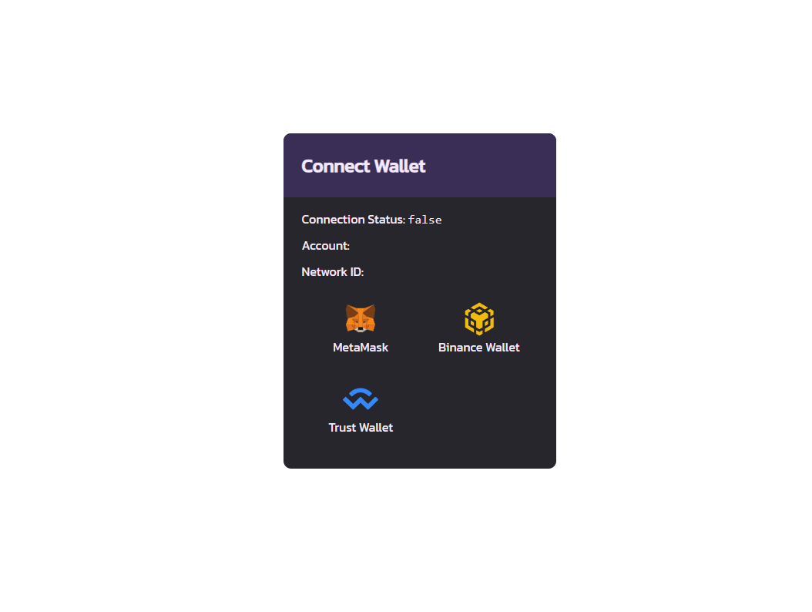

## Web3 Wallet providers

This is a Next.js site to showcase basic snippets for connecting to Web3 wallets using web3-react and get token balances from the BSC network, inspired by Pancakeswap modal.

Currently supports Binance Smart Chain but can be extended to support other networks.

  
